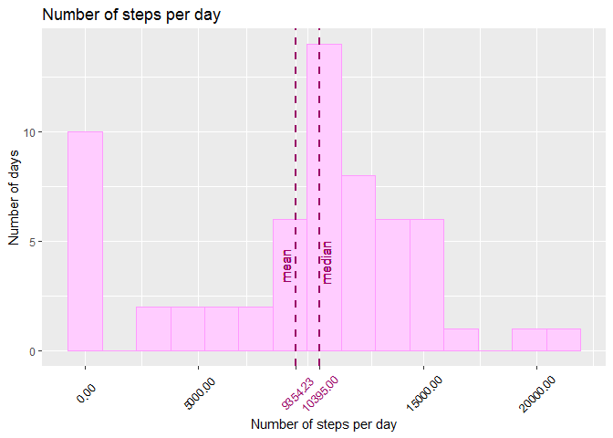

## Loading and preprocessing the data

First we read the data and take a look at it:

```r
RawData<-read.csv("activity.csv")
summary(RawData)
```

```
##      steps                date          interval     
##  Min.   :  0.00   2012-10-01:  288   Min.   :   0.0  
##  1st Qu.:  0.00   2012-10-02:  288   1st Qu.: 588.8  
##  Median :  0.00   2012-10-03:  288   Median :1177.5  
##  Mean   : 37.38   2012-10-04:  288   Mean   :1177.5  
##  3rd Qu.: 12.00   2012-10-05:  288   3rd Qu.:1766.2  
##  Max.   :806.00   2012-10-06:  288   Max.   :2355.0  
##  NA's   :2304     (Other)   :15840
```


## What is mean total number of steps taken per day?

For further we need some packages:

```r
library(ggplot2)
library(dplyr)
```

```
## 
## Attaching package: 'dplyr'
```

```
## The following objects are masked from 'package:stats':
## 
##     filter, lag
```

```
## The following objects are masked from 'package:base':
## 
##     intersect, setdiff, setequal, union
```

We group our Data by dates and summarize it. Now we can see mean and median values of number of steps per day:

```r
DataByDate <- group_by(RawData, date)
SumByDate <- summarise(DataByDate, 
                       steps = sum(steps, na.rm = TRUE))
mean(SumByDate$steps, na.rm = TRUE)
```

```
## [1] 9354.23
```

```r
median(SumByDate$steps, na.rm = TRUE)
```

```
## [1] 10395
```

Now we are ready to print a histogram using ggplot2-package:

```r
c <- ggplot(SumByDate, aes(SumByDate$steps))
c <- c + geom_histogram(color = "#FF99FF", 
                      fill = "#FFCCFF", 
                      bins = 15)
c <- c + geom_vline(aes(xintercept = mean(SumByDate$steps)), 
                  color = "#990066",
                  linetype ="dashed",
                  size = 1)
c <- c + geom_vline(aes(xintercept = median(SumByDate$steps)),
                  color = "#990066", 
                  linetype ="dashed",
                  size = 1)
c <- c + geom_text(aes(x=mean(SumByDate$steps),
                       y=0,
                       label="mean"), 
                   size=4, 
                   angle=90,
                   vjust=-0.5, 
                   hjust= -2,
                   color = "#990066")
c <- c + geom_text(aes(x=median(SumByDate$steps),
                       y=0,
                       label="median"), 
                   size=4, 
                   angle=90,
                   vjust= 1, 
                   hjust= -1.5,
                   color = "#990066")
c <- c + labs(title = "Number of steps per day", 
              y = "Number of days",
              x = "Number of steps per day"
           )
c <- c + scale_x_continuous(breaks = c(0,
                                       5000, 
                                       mean(SumByDate$steps),
                                       median(SumByDate$steps), 
                                       15000, 
                                       20000)
                            )
c <- c + theme(axis.text.x = element_text(color = c("black",
                                                    "black",
                                                    "#990066", 
                                                    "#990066", 
                                                    "black",
                                                    "black"),
                                          angle = 45,  
                                          vjust = 0.5
                                          )
               )

plot(c)
```

<!-- -->


## What is the average daily activity pattern?


We group our data by interval and summarise to find some patterns across all days:

```r
DataByInterval <- group_by(RawData, interval)
AvgByInterval <- summarise(DataByInterval, steps = mean(steps, na.rm = TRUE))
```
Now we can look at maximum average number of steps per interval:

```r
MaxSteps <- max(AvgByInterval$steps)
MaxSteps
```

```
## [1] 206.1698
```
And the interval itself:

```r
MaxStepsInt <- AvgByInterval[which(AvgByInterval$steps == MaxSteps), "interval"]
MaxStepsInt
```

```
## # A tibble: 1 x 1
##   interval
##      <int>
## 1      835
```

Now we are ready to display this information as a time series plot of the 5-minute interval (x-axis) and the average number of steps taken, averaged across all days (y-axis).


```r
MaxStepsInt <- as.numeric(MaxStepsInt)
c <- ggplot(AvgByInterval, aes(x = interval, y = steps))
c <- c + geom_line(size = 1, color = "#00CCCC")
c <- c + geom_hline(aes(yintercept = MaxSteps),
                    color = "red", 
                    linetype = "dashed"
                    )
c <- c + geom_vline(aes(xintercept = MaxStepsInt),
                    color = "red", 
                    linetype = "dashed")
c <- c + labs(title = "Average number of steps per interval", 
              y = "Avg. number of steps",
              x = "5-minute interval number"
           )
c <- c + scale_x_continuous(breaks = c(0, 
                                       500, 
                                       MaxStepsInt, 
                                       1000, 
                                       1500, 
                                       2000)
                            )
c <- c + theme(axis.text.x = element_text(color = c("black",
                                                    "black",
                                                    "red", 
                                                    "black", 
                                                    "black",
                                                    "black")
                                          )
               )

plot(c)
```

<!-- -->


## Imputing missing values

First let's take a look on amount of NA's in our data:


```r
sum(is.na(RawData$steps))
```

```
## [1] 2304
```

Now we will form a new dataset with filled in NA's by the average number of steps across all days for this interval:


```r
FullData <- RawData
FullData <- left_join(FullData, AvgByInterval, by = "interval")
FullData$steps.x[is.na(FullData$steps.x)] <- FullData$steps.y[is.na(FullData$steps.x)]
summary(FullData)
```

```
##     steps.x               date          interval         steps.y       
##  Min.   :  0.00   2012-10-01:  288   Min.   :   0.0   Min.   :  0.000  
##  1st Qu.:  0.00   2012-10-02:  288   1st Qu.: 588.8   1st Qu.:  2.486  
##  Median :  0.00   2012-10-03:  288   Median :1177.5   Median : 34.113  
##  Mean   : 37.38   2012-10-04:  288   Mean   :1177.5   Mean   : 37.383  
##  3rd Qu.: 27.00   2012-10-05:  288   3rd Qu.:1766.2   3rd Qu.: 52.835  
##  Max.   :806.00   2012-10-06:  288   Max.   :2355.0   Max.   :206.170  
##                   (Other)   :15840
```
Now we can see, that there are no NA's in steps-column any more.

Let's see how mean and median estimates of total number of steps taken per day changed after imputing missing values:

```r
FDataByDate <- group_by(FullData, date)
FSumByDate <- summarise(FDataByDate, 
                       steps = sum(steps.x))
mean(FSumByDate$steps)
```

```
## [1] 10766.19
```

```r
median(FSumByDate$steps)
```

```
## [1] 10766.19
```
We can see, that the estimates increased (and somehow became equal).

Now let's look on hystogram:

```r
c <- ggplot(FSumByDate, aes(FSumByDate$steps))
c <- c + geom_histogram(color = "#FF99FF", 
                      fill = "#FFCCFF", 
                      bins = 15)
c <- c + geom_vline(aes(xintercept = mean(FSumByDate$steps)), 
                  color = "#990066",
                  linetype ="dashed",
                  size = 1)
c <- c + geom_vline(aes(xintercept = median(FSumByDate$steps)),
                  color = "#990066", 
                  linetype ="dashed",
                  size = 1)
c <- c + labs(title = "Number of steps per day", 
              y = "Number of days",
              x = "Number of steps per day"
           )
c <- c + scale_x_continuous(breaks = c(0, 5000, mean(FSumByDate$steps), median(FSumByDate$steps), 15000, 20000))
c <- c + theme(axis.text.x = element_text(color = c("black",
                                                    "black",
                                                    "#990066", 
                                                    "#990066", 
                                                    "black",
                                                    "black")
                                          )
               )

plot(c)
```

<!-- -->


## Are there differences in activity patterns between weekdays and weekends?

Now we are going to look at activity patterns on weekdays and weekends. First we need to flag our data:


```r
FullData$wday <- factor(case_when(weekdays(as.Date(FullData$date)) %in% c("Sunday", "Saturday") ~ "weekend",
                                  TRUE ~ "weekday"
                                  )
                        )
summary(FullData)                       
```

```
##     steps.x               date          interval         steps.y       
##  Min.   :  0.00   2012-10-01:  288   Min.   :   0.0   Min.   :  0.000  
##  1st Qu.:  0.00   2012-10-02:  288   1st Qu.: 588.8   1st Qu.:  2.486  
##  Median :  0.00   2012-10-03:  288   Median :1177.5   Median : 34.113  
##  Mean   : 37.38   2012-10-04:  288   Mean   :1177.5   Mean   : 37.383  
##  3rd Qu.: 27.00   2012-10-05:  288   3rd Qu.:1766.2   3rd Qu.: 52.835  
##  Max.   :806.00   2012-10-06:  288   Max.   :2355.0   Max.   :206.170  
##                   (Other)   :15840                                     
##       wday      
##  weekday:12960  
##  weekend: 4608  
##                 
##                 
##                 
##                 
## 
```

Now we can group our data by wday-flag and interval:

```r
FDataByIntWday <- group_by(FullData, interval, wday)
FAvgByIntWday <- summarise(FDataByIntWday, steps = mean(steps.x))
```

Now we are ready to print a plot with two patterns - for weekdays and for weekends:

```r
c <- ggplot(FAvgByIntWday, aes(x = interval, y = steps))
c <- c + geom_line(size = 1, color = "#00CCCC")
c <- c + facet_wrap(vars(wday), ncol = 1, nrow = 2) 
c <- c + labs(title = "Activity patterns", 
              y = "Avg. number of steps",
              x = "5-minute interval"
           )
plot(c)
```

<!-- -->
